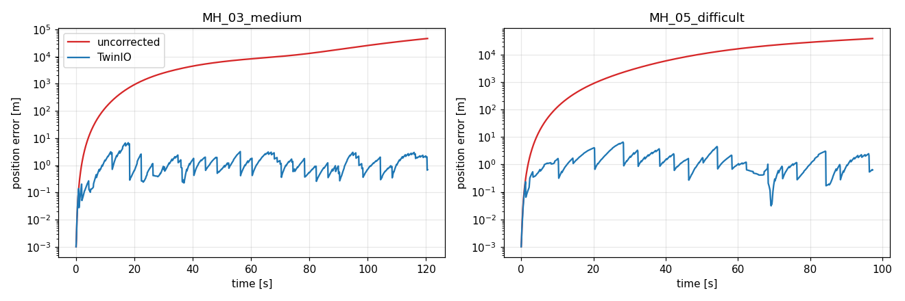

# TwinIO: Twin-covariance Inertial Odometry for the AUV, Mirrored on the ASV

This repo holds the TwinIO program and a sample dataset to test it.

* **AUV side (IMU only).** A causal CNN-LSTM predicts body-frame velocity from raw IMU
  data. That prediction and its covariance are fused in a 15-state error-state Kalman
  filter.
* **ASV side.** The ASV keeps a shadow copy of each AUV's covariance. When the shadow
  exceeds a budget, it requests a USBL fix and positions itself with MPPI. The fix updates
  both the AUV filter and the shadow, so no covariance is ever sent over the acoustic link.

## How to run

Requires Python 3.9 or later. Runs on CPU; no GPU is needed.

```bash
pip install -r requirements.txt
python demo.py
```

The demo takes about 3–5 minutes on a laptop CPU. Two AUVs replay the IMU of two EuRoC
flights, and each is run twice:

| run | what it is |
|---|---|
| **uncorrected** | plain IMU dead reckoning: no learned aid, no USBL fixes |
| **TwinIO** | learned velocity aid + ASV shadow-triggered USBL fixes |

The demo prints the position errors and saves `results/twinio_vs_uncorrected.png`.

## Result

| flight | uncorrected RMSE | TwinIO RMSE | TwinIO final error | USBL pings |
|---|---|---|---|---|
| MH_03_medium (131 s) | 17,463 m | **1.64 m** | 0.68 m | 30 |
| MH_05_difficult (111 s) | 18,393 m | **1.85 m** | 0.63 m | 25 |



## Dataset

`sample_data/` contains the **EuRoC MAV dataset, machine-hall sequences MH_01 to MH_05**.
Only the IMU (ADIS16448, 200 Hz) and the ground truth are included. The camera images are
left out because TwinIO uses the IMU only.

* The network was trained on MH_01, MH_02 and MH_04.
* The demo tests on MH_03 and MH_05, which the network has never seen.
* USBL fixes are simulated from the ground truth with the paper's measurement model.

Dataset citation: M. Burri et al., "The EuRoC micro aerial vehicle datasets,"
*Int. J. Robotics Research*, 35(10), 2016.

## Files

```
demo.py                  run this
config.json              settings used for the results above
models/velocity_net.pt   trained velocity network (155,139 parameters)
twinio/                  the method
  model.py               CNN-LSTM velocity network
  covariance.py          measurement covariance of the network output
  eskf.py                15-state AUV error-state Kalman filter, delayed-fix replay
  shadow.py              ASV shadow of the AUV covariance
  mppi.py                ASV positioning (MPPI)
  usbl.py                USBL fix model
  sim.py                 AUV + ASV cooperative loop (trigger, channel, packet loss)
  data.py, config.py, geometry.py
sample_data/             EuRoC MH_01-MH_05 IMU + ground truth
```
